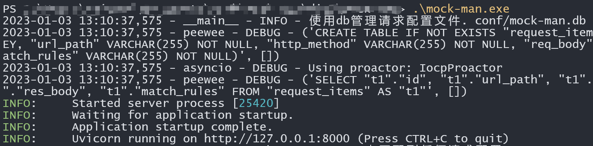
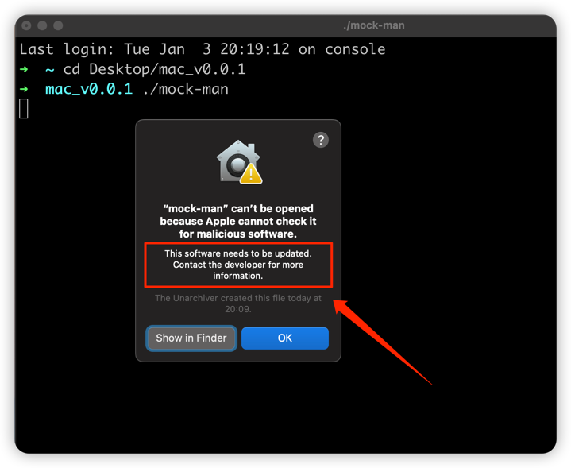
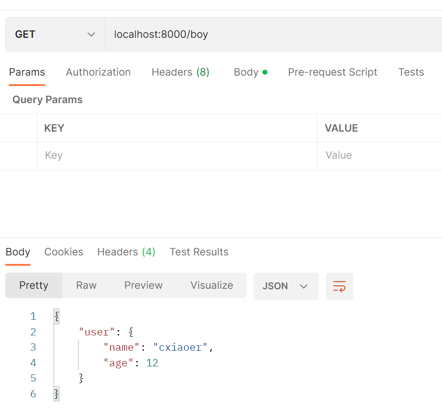

<h1 align="center">Welcome to mock-man 👋</h1>
<p>
  <a href="https://www.npmjs.com/package/mock-man" target="_blank">
    
  </a>
  <a href="https://github.com/cxiaoer/mock-man" target="_blank">
    
  </a>
  <a href="#" target="_blank">
    
  </a>
</p>

> a simple local json http mock tool executable

### 🏠 [Homepage](https://github.com/cxiaoer/mock-man)

## Install

### windows

* download the latetes [zip](https://github.com/cxiaoer/mock-man/releases) package, and unzip it
* switch the folder ,open the cmd , and input the cmd as follows
    ```shell
    .\mock-man.exe
    ```
  > windows 7 is not supported.

* if you can see as follows, it starts success
  

### mac

* download the latetes [zip](https://github.com/cxiaoer/mock-man/releases) package, and unzip it
* do other steps like windows
* if you run the startup cmd, you may get 

  
* please agree the trust `mock-man` app in the mac `Privacy & Security` settings

   > the mock-man have been tested in the amd mac pc. 

## Usage

### start server

if you use windows, run

```shell
.\mock-man.exe
```

you can also view the start options use ``-h``

### config request

when the server started,if the port is `8000`, you can visit the ``http://127.0.0.1:8000/ui`` to config the request

> if match_method is `ALL`, it means the req body json should full match\
> if match_method is `ANY`, it means that any req body will match success if the ant url matches

### visit the http endpoint
after you have add a simple api endpoint(`/boy`), you can visit 
the `localhost:8000/boy` as follows


## Author

👤 **cxiaoer**

* Website: https://github.com/cxiaoer
* Github: [@cxiaoer](https://github.com/cxiaoer)

## 🤝 Contributing

Contributions, issues and feature requests are welcome!<br />Feel free to check [issues page](mock-man/issues).

## Show your support

Give a ⭐️ if this project helped you!

***
_This README was generated with ❤️ by [readme-md-generator](https://github.com/kefranabg/readme-md-generator)_